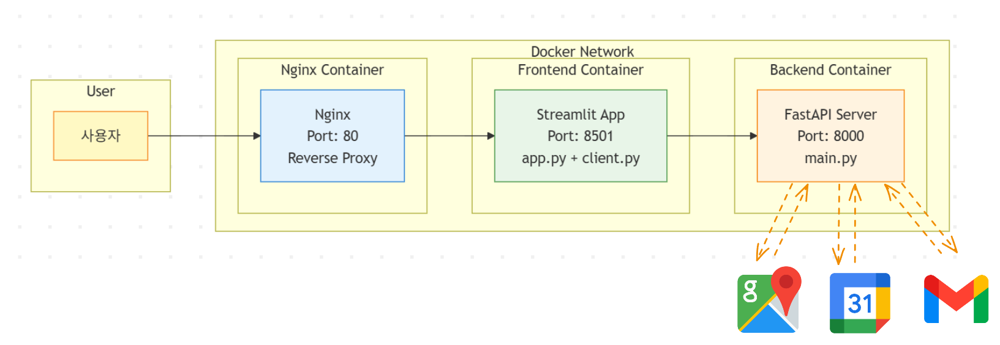
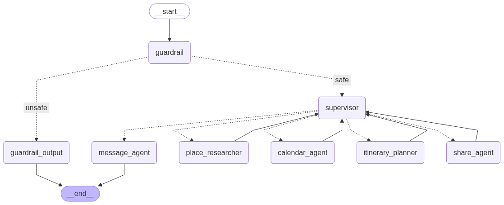
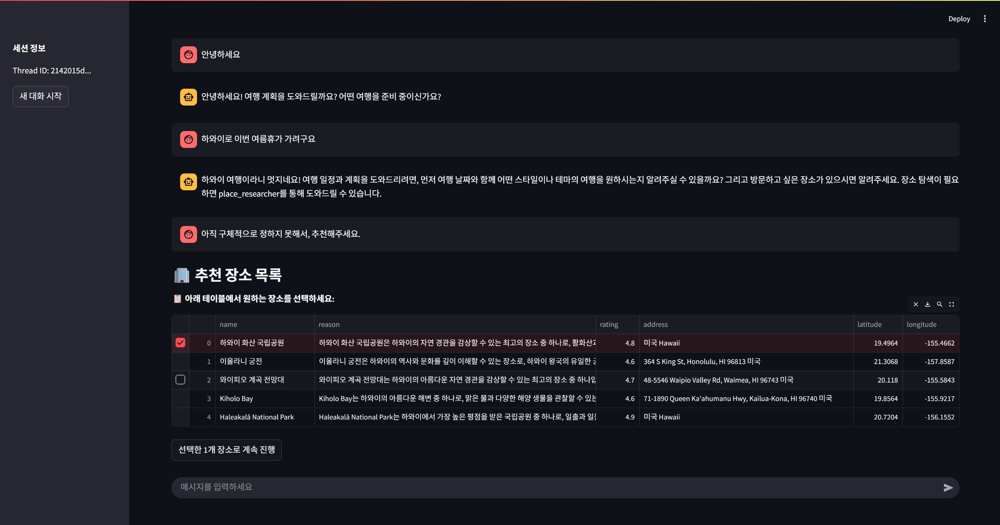

# 여행 계획 AI 서비스

멀티 에이전트 AI 시스템을 활용하여 자연스러운 대화를 통해 개인화된 여행 일정을 생성하는 지능형 여행 계획 서비스입니다.

## 시스템 아키텍처

<div align="center">
  
  <br>
</div>

### 시스템 구성 요소

| 구성 요소 | 기술 스택 | 포트 | 설명 |
|-----------|-----------|------|------|
| **웹 프록시** | Nginx | 80 | 단일 진입점, Streamlit으로 요청 전달 |
| **프론트엔드** | Streamlit | 8501 | 대화형 웹 인터페이스 |
| **백엔드** | FastAPI | 8000 | 멀티 에이전트 시스템 기반 REST API |

### 주요 기능
<div align="center">
  
  <br>
</div>

- **멀티 에이전트 시스템**: 각 작업에 특화된 전문 에이전트를 감독하는 Supervisor Agent System 구현
    - **Supervisor**: 사용자 요청을 분석하고 적절한 에이전트에게 작업을 할당하는 중앙 관리자
    - **place_researcher**: Google Maps API를 활용하여 여행지 정보를 검색하고 분석하는 에이전트
    - **itinerary_planner**: 검색된 장소들을 바탕으로 최적의 여행 일정을 계획하는 일정 수립 에이전트
    - **calendar_agent**: Google Calendar API를 통해 여행 일정을 캘린더에 등록하는 일정 관리 에이전트
    - **share_agent**: Gmail API를 활용하여 완성된 여행 계획을 이메일로 공유하는 에이전트
    - **message_agent**: 사용자와의 모든 대화를 담당하며, 다른 에이전트들의 작업 결과를 자연스럽게 전달하는 대화형 인터페이스 에이전트
- **Human-in-the-loop**: 장소 검색 결과 중 사용자가 직접 선택하여 개인화된 여행 계획 수립
- **가드레일**: Llama Guard를 활용한 사용자 입력 안전성 검증 및 부적절한 요청 필터링


### 실행 모습

<div align="center">
  
  <br>
</div>

- 검색 결과를 사용자가 선택하고 그래프를 재개할 수 있는 휴먼인더루프 기능 구현
- 선택한 장소를 기반으로 여행 일정 생성


## 환경 설정

#### 1. 환경 변수 설정

1. `.env` 파일 생성:
```bash
cp .env.example .env
```

2. 필요한 API 키 설정:
```env
OPENAI_API_KEY=your_openai_api_key
GOOGLE_API_KEY=your_google_api_key
GOOGLE_MAP_API_KEY=your_google_maps_api_key
# ... 기타 설정
```

3. backend 디렉토리로 복사:
```bash
cp .env backend/.env
```

#### 2. 구글 클라우드 콘솔 설정
1. [Google Cloud Console](https://console.cloud.google.com/)에 접속
2. 새 프로젝트 생성 또는 기존 프로젝트 선택
3. 다음 API들을 활성화:
   - **Google Maps JavaScript API**
   - **Google Calendar API** 
   - **Gmail API**
   - **Google Places API**

#### 인증 정보 생성
1. Google Cloud Console → "API 및 서비스" → "사용자 인증 정보"
2. "사용자 인증 정보 만들기" → "서비스 계정"
3. 서비스 계정 생성 후 JSON 키 다운로드
4. 다운로드한 파일을 `backend/credentials.json`으로 저장
5. Gmail과 Calendar API 사용을 위해 최초 1회 인증이 필요합니다

#### OAuth 2.0 설정 (Gmail, Calendar 용)
1. "사용자 인증 정보 만들기" → "OAuth 2.0 클라이언트 ID"
2. 애플리케이션 유형: "데스크톱 애플리케이션"


---

```bash
# 저장소 복제 및 애플리케이션 실행
git clone <repository-url>
cd planner
docker-compose up -d
```

`http://localhost`으로 접속할 수 있습니다.

## 기술 스택

- **백엔드**: FastAPI, LangGraph, LangChain
- **프론트엔드**: Streamlit
- **AI 모델**: OpenAI GPT
- **외부 API**: Google Maps, Google Calendar, Gmail
- **인프라**: Docker, Nginx